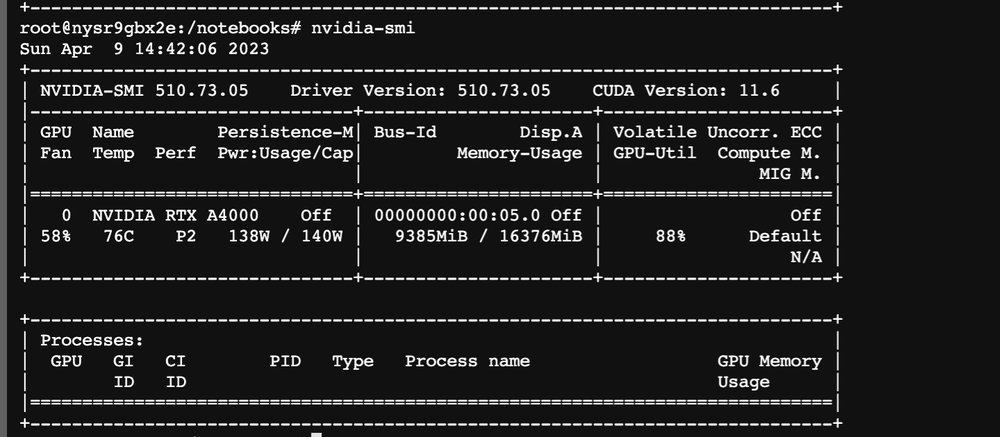

# Finetune Alpaca 🦙

This repository contains code to finetune the Llama 🦙 model using the Alpaca 🦙 dataset available on HuggingFace

The `finetune_alpaca.ipynb` contains the code to download the **Llama** weights from HuggingFace Hub using the `LlamaForCausalLM`. 

This model can be trained on a single GPU machine and takes less than 10 GB of GPU RAM. 

The model is converted to 8-bit and is trained with gradient accumulation